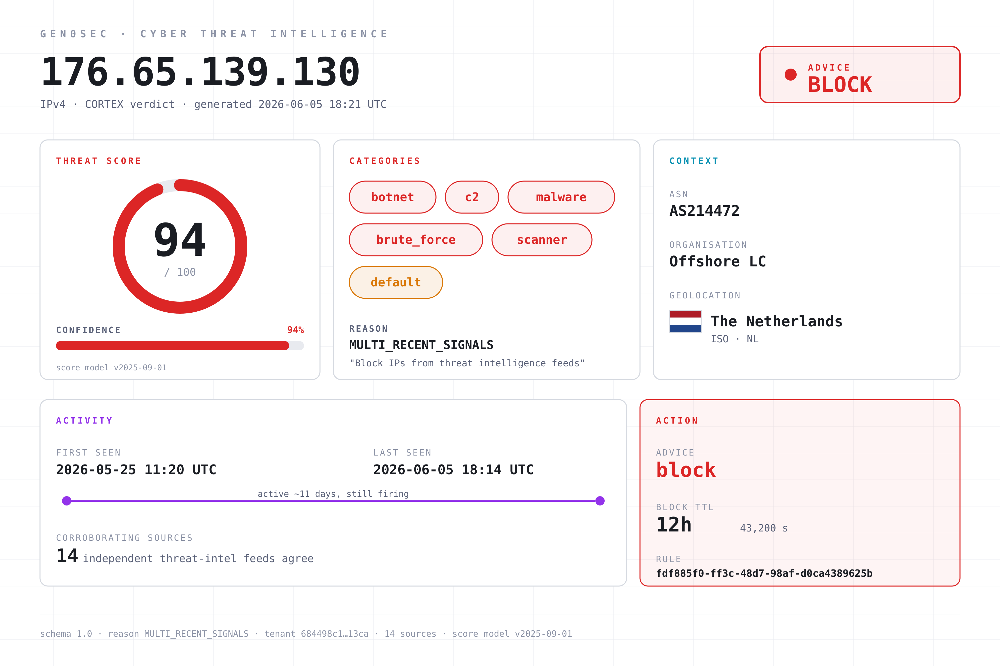
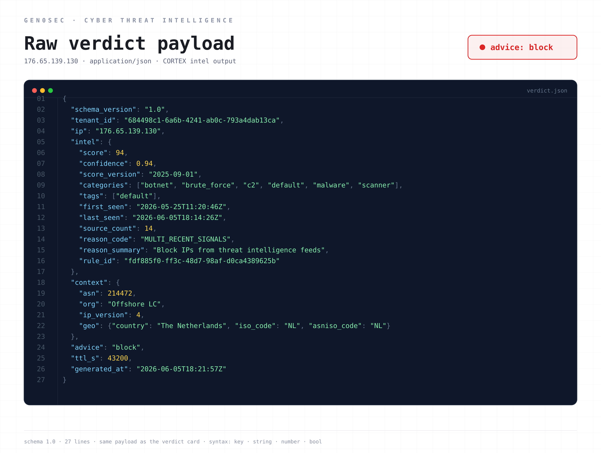

# Layer 01 — Forward observation

*The cavalry vedette and the canary token: why your CTI feed is a forward observer, and why most are forward observers with broken radios.*

## A short history of seeing first

The German army of 1916 had an information problem. Allied artillery had matured to the point where a static, prepared defensive line could be flattened with mathematical precision. The British and French were learning to map every German trench from balloons and aerial photographs, then plaster the line with creeping barrages timed to their infantry assault. The denser and more carefully fortified the German position, the more efficiently it could be reduced to mud. Holding ground had become a way of being targeted.

The General Staff's answer was to stop holding the front line densely, and to push light, mobile screening units far forward of it. The screening force was called the *Vorpostenlinie*, the outpost line. It was made of light infantry, cavalry vedettes, and listening posts (*Lauschposten*). They were not there to fight. They were there to see, hear, and report.

The cultural inversion is the part that matters. Pre-war Prussian doctrine had been about holding ground at all costs. The elastic-defense outpost line was about trading ground for information. A vedette who returned with timely intelligence was worth more than a trench that held an extra hour and then fell. The staff trained outpost troops to expect they would be bypassed, surrounded, and ignored by the main attacking force. Their assignment was the *warning*, not the battle.

The doctrinal innovation was that warning is an output of its own. A defender who knows the attack is coming has options. Reinforce the threatened sector. Pre-position reserves. Pre-register artillery on the likely axis of advance. Cancel leave. Move the casualty clearing station. A defender who learns the attack is coming when the artillery starts has only reactions. The *Vorpostenlinie* existed to convert future combat into present knowledge.

The outpost line was not the only forward-looking element in the defensive scheme. The Germans, like every other army in the war, made heavy use of *Scheinstellungen*: dummy positions built to look like the real thing from the air. Fake trenches dug a metre deep and lined with sandbags. *Scheinbatterien*, dummy artillery batteries complete with wooden guns and straw-stuffed crew, that drew counter-battery fire and revealed the enemy's gunnery positions in the process. Decoy supply dumps. Mock troop concentrations laid out to mislead aerial photographers. A *Scheinstellung* was a fortification that existed entirely to be attacked. When the British fired their counter-battery preparation on a dummy battery, the Germans learned three things: where the British guns were, what calibre they were, and what fire plan they were running. The information was paid for in wood and straw rather than in casualties.

The mode of intelligence is different from the outpost. The cavalry vedette generates intelligence passively. It sees what the attacker is doing and reports. The *Scheinstellung* generates intelligence actively. It provokes the attacker into doing something that reveals capability. Both belong in the same forward zone, and modern defenders use both.

A century later, this is still the right way to think about the layer of any defensive architecture that sits in front of the perimeter.

## The technical version

In a modern network the *Vorpostenlinie* is everything that gives you signal about an attack before the attack reaches your perimeter. It is not the perimeter. It is the layer beyond.

The components are familiar by category. Threat intelligence feeds, structured and unstructured, commercial and open source. Honeypots and honeynets, deployed inside your address space or as deception layers on internal segments. Canary tokens embedded in documents, credentials, and source code. DNS sinkholes that catch lookups for known-bad infrastructure. Passive DNS and CT-log monitoring for domains that mimic yours. Behavioural telemetry from sensors deployed in the wild that fingerprint scanning, reconnaissance, and pre-attack traffic patterns. Information sharing from peers in your sector, ISAC participation, sometimes vendor-specific telemetry from your own products in production.

The mistake almost everyone makes is to treat this layer as theatre. A CTI dashboard that nobody actions is a forward observer with a broken radio. The intelligence is collected, displayed, sometimes weekly-reported on, and never produces a change in posture. Either nobody is reading it, or nobody can convert what they read into a defensive action within a useful time window. Both failure modes are common. Both invert the doctrine.

A useful Layer 01 has three properties.

**It produces actions, not reports.** The output of a good threat intel pipeline is not "we saw a new APT campaign" but "we just pushed a block on these IPs at the edge, alerted the SOC, and queued a hunt on these YARA patterns across the EDR." If the workflow stops at human reading, the layer is broken. Intelligence that does not become enforcement is intelligence that does not exist.

**It is opinionated about noise.** Most CTI feeds are 90% noise. Generic IOC lists go stale within hours. Reputation scores conflate different threat models. A useful Layer 01 has a confidence model and a freshness model, and it filters incoming signal against both before any of it touches the production stack. Cheap, fast filtering at the intel layer is the prerequisite for cheap, fast enforcement at the edge. Without it, you are pushing low-confidence garbage into Layer 02 and creating false positives that cost real money.

**It correlates across sources.** A single feed claiming an IP is malicious is weak evidence. Three feeds, plus passive DNS showing newly-registered infrastructure, plus a canary token triggering, plus a known-good peer reporting the same IP in their sector, is strong evidence. The job of Layer 01 is to combine those signals into a confidence score that downstream layers can trust.

There is a doctrinal trap to watch for. The *Vorpostenlinie* was not the *Hauptkampflinie*. The outpost line was supposed to be light. If you make it heavy, you have just put your main defensive zone too far forward, and the artillery problem comes back. The network equivalent: do not put expensive, latency-sensitive analysis into Layer 01. The forward observer's job is to see and tell. The deep inspection happens further back where it can be done at depth, with context, with time. If you find yourself running deep ML inference on every CTI signal at intake, you have inverted the architecture.

There is also a timing question that is easy to get wrong. Pre-WWI cavalry vedettes were positioned to give a defender hours of warning, not seconds. The modern equivalent: Layer 01 is the layer where you have *time*. If you are using it to make millisecond decisions, you are using it as the edge, not as the outpost. The right time horizon is "we have meaningful warning before the adversary reaches our infrastructure." Anything inside that horizon belongs in Layer 02 or Layer 03.

A final point about deception. Honeypots and canary tokens are the modern *Scheinstellung*. They have one property no other source of intel has: when they fire, there is no false-positive problem. A canary token in a document has no business being touched by anyone. If someone interacts with it, you know something. A honeypot accepting an SSH login is, by construction, an attacker. The signal-to-noise ratio is essentially perfect. This is the same property that made the dummy artillery battery valuable: it could not produce a false positive because legitimate traffic had no reason to fire on it. Yet most organisations either do not deploy honeypots and canaries, or deploy them and never wire the alerts into the response pipeline. That is the modern equivalent of building *Scheinstellungen* and then never reading the counter-battery observation reports.

## How Gen0Sec implements Layer 01

We treat Layer 01 as a feedback loop, not a feed.

**Synapse agents and Cerebrum sensors in the wild act as forward observers.** Every customer deployment is also a passive sensor. Inside Synapse, this is Dendrite: the capture layer, the component that observes every flow off the wire. Dendrite is the shared input plane the rest of the binary reads from, and at Layer 01 it is the sensor's eyes. The same Synapse that runs the Hillock enforcing firewall also has Dendrite producing JA4+ telemetry on every flow it sees, with a privacy boundary that keeps customer content opaque but allows the fingerprints, the connection metadata, and the reputation context to be aggregated across the fleet by Cerebellum. A novel attacker stack hitting one customer is a fingerprint that every other customer's edge benefits from within minutes. The *Vorpostenlinie* analogy is exact: the outpost is light, fast, and feeds the staff behind it.

**Cerebellum consumes external signal.** Commercial CTI feeds, open-source intelligence, ISAC participation, JA4+ telemetry from the sensor fleet, peer-reported indicators. Cerebellum is the backend platform that ingests them, scores them, decays them, and correlates them across every site it sees. The output is not a list of bad IPs. The output is a set of policies the rest of the stack can subscribe to: a Hillock blocklist that updates over the wire, a Thalamus rule signature with a confidence score, a Workflow playbook trigger. (Cortex, the ML layer inside Synapse, is a separate thing. It does local pattern recognition on the traffic each sensor sees, and it does not touch the CTI pipeline.)

**Deception is integrated, not bolted on.** Canary tokens, honeynet stubs, and DNS sinkholes are first-class signal sources. When one of them fires it does not go to a separate dashboard. It triggers the same Layer 01 → Layer 02 → Layer 03 → Layer 04 propagation as any other high-confidence indicator. A canary touch in finance and a Cerebellum correlation on a JA4T from the same /24 in the next hour are treated as the same incident, joined automatically.

**Output is enforcement, with audit.** Every Layer 01 signal that becomes a defensive action is logged with its provenance. You can see, for any block that fired in the last 90 days, which Layer 01 source first surfaced the indicator, what confidence Cerebellum assigned it, and which downstream layer carried it into enforcement. This is not optional. The closing of the loop is the entire reason the layer exists.

The point of the outpost is the warning, not the report. If your Layer 01 produces reports instead of warnings, and warnings instead of enforcement, you have built a dashboard, not a defensive zone.

## What our CTI actually emits

Most threat intelligence is a list. A CSV of bad IPs, maybe with a category column, maybe with a timestamp. You subscribe, you ingest, you block. The problem with a list is that it has no opinion and no expiry. It cannot tell you how sure it is, why it flagged the entry, how many independent sources agree, or when the verdict stops being true.

Cerebellum does not emit a list. It emits a *verdict*: a structured, scored, time-bounded judgement about a single indicator, designed to be consumed by a machine and audited by a human. Here is a real one.

Walk the fields, because each one maps to a doctrinal property of the outpost line.

**The score and confidence are the strength of the warning.** This verdict scores the IP at 94 out of 100, with 0.94 confidence. The score is what the indicator is worth; the confidence is how sure Cerebellum is that the score is right. The two are separate on purpose. A high score with low confidence is a guess. A high score with high confidence, backed by corroboration, is the kind of warning a defender can act on without a human in the loop. The cavalry vedette who reported "a column, maybe a division, somewhere to the north" was low-confidence. The one who reported "the 3rd Guards, two batteries, moving on the Cambrai road at 0400" was high-confidence. The staff treated them differently. So does Cerebellum.

**The source_count is corroboration.** Fourteen independent feeds agree on this indicator, combined with the platform's own JA4+ telemetry. One feed claiming an IP is malicious is weak evidence. Fourteen is the difference between a rumour and a fact. The reason_code, `MULTI_RECENT_SIGNALS`, says exactly that: this verdict is built on multiple, recent, corroborating signals, not a single stale list entry.

**The categories are what kind of threat.** `botnet`, `brute_force`, `c2`, `malware`, `scanner`. The verdict is not just "bad" but "bad in these specific ways," which lets the downstream layers route the response. A bare scanner can be rate-limited at the edge; a confirmed C2 endpoint gets a hard block and an incident.

**The first_seen / last_seen window is the freshness of the intelligence.** This IP has been active for eleven days and was last seen firing minutes before the verdict was generated. A verdict on an indicator last seen two years ago is archaeology. A verdict on one still firing is actionable.

**The ttl_s is the decay, and it is the field most threat-intel lists are missing entirely.** The verdict has a time-to-live of 43,200 seconds, twelve hours. After that it expires and must be re-derived from fresh signal. Intelligence is perishable. The vedette's report was true when he made it and false an hour later when the enemy had moved. A verdict without an expiry is a verdict that will eventually be wrong and never know it. Cerebellum bakes the expiry into the output.

**The advice and rule_id are the warning turned into action, with provenance.** The advice is `block`. The rule_id ties this specific verdict back to the policy that produced it, so every enforcement action is auditable to the exact rule and signal that caused it. This is the closing of the loop: the outpost's report does not stop at a dashboard, it becomes a block at the edge, and the block can be traced back to the report.

Underneath the card it is plain JSON, designed to be consumed by Hillock, Thalamus, and Workflow without a human in the path.

That is the whole point of Layer 01. The intelligence is not the deliverable. The scored, time-bounded, auditable, machine-actionable verdict is.

---

## Historical sources

- *Grundsätze für die Führung in der Abwehrschlacht im Stellungskrieg* (Principles of Command in the Defensive Battle in Positional Warfare), Oberste Heeresleitung, 1 December 1916. The canonical elastic-defense doctrine, issued under Erich Ludendorff. The *Vorpostenlinie* concept is articulated here.
- Timothy T. Lupfer, *The Dynamics of Doctrine: The Changes in German Tactical Doctrine During the First World War*, Leavenworth Papers No. 4, US Army Combat Studies Institute, 1981. The standard English-language scholarly treatment of the German doctrinal cycle.
- G.C. Wynne, *If Germany Attacks: The Battle in Depth in the West*, Faber and Faber, 1940. Detailed British analysis of German defensive doctrine and the role of the forward outpost zone in particular.
- Bruce I. Gudmundsson, *Stormtroop Tactics: Innovation in the German Army, 1914–1918*, Praeger, 1989. Useful background on the German army's broader cycle of tactical innovation, of which elastic defense is the defensive half.
- Guy Hartcup, *Camouflage: A History of Concealment and Deception in War*, Pen and Sword, 1979 (reissued 2008). The standard history of WWI camouflage and deception, including *Scheinstellungen*, *Scheinbatterien*, and the development of aerial-photography countermeasures on both sides.

---

*This is part 1 of a 5-part series on elastic network defense. Layer 02 covers the forward defensive belt: wire-speed edge controls and where they fit doctrinally.*
