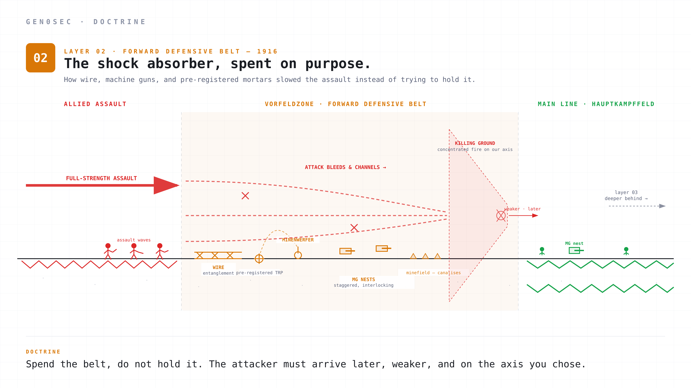
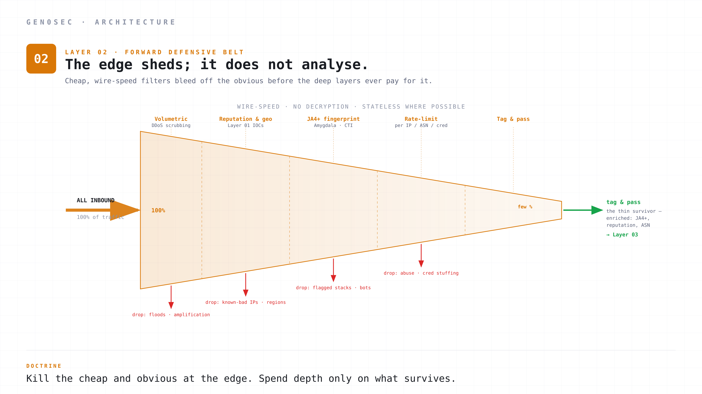

# Layer 02 — Forward defensive belt

*Wire entanglements and the edge: why the layer that meets the attacker first should be cheap, stupid, and deliberately attritional.*

## A short history of the shock absorber

By the autumn of 1916 the German army had accepted that the front line could not hold against a determined, well-supported attack. The next question was what to put in front of the main defensive zone, given that the main zone was now expected to be penetrated.

The answer was the *Vorfeldzone*, the forward defensive belt. It sat between the outpost line and the *Hauptkampffeld*. Its job was to slow, channel, and bleed assault waves before they reached the prepared killing ground further back.

The belt was made of cheap, attritional, deliberately expendable positions. Wire entanglements, prepared machine-gun nests at staggered intervals, mortar Target Reference Points so pre-registered that the crews could fire on them in fog, hasty trench lines designed to fall in a few hours, minefields planted to canalise the attacker into the killing ground. The belt was not where the battle was won. The belt was where the battle was *slowed*.

The doctrinal trick was to commit to that. The German staff knew the belt would be lost. They wrote the doctrine assuming it would be lost. The success criterion was not "we held the belt" but "the attacker arrived at the *Hauptkampffeld* later, weaker, and on the axis we wanted." Holding the belt was a sin against the doctrine. A unit commander who burned through his reserves trying to hold the *Vorfeldzone* was depriving the main zone of forces and timing. The belt existed to be expendable. Spending it carefully was the job. Hoarding it was a failure.

The other doctrinal trick was that the belt had to be *cheap*. Wire is cheap. Mines are cheap. A mortar pit dug in twelve hours and fired by two men with pre-registered target lists is cheap. If you start putting your heavy weapons forward to "make the belt stronger," you have just rebuilt the pre-1916 fixed line, and you are about to relearn why it does not work. Cheap, fast, attritional, expendable. Anything else inverts the layer.

A century later, this is the right way to think about your edge.

## The technical version

In a modern network architecture the *Vorfeldzone* is the layer that meets the attacker first. It is what most people mean when they say "the edge." Its components are familiar.

Volumetric DDoS scrubbing, usually upstream or in front of the public interfaces. Web application firewalls and bot management for HTTP-shaped traffic. Rate limiters per source IP, per geographic region, per ASN, per credential. Geo-blocking and country allowlists. Reputation-based blocks against the indicators surfaced by Layer 01. TLS fingerprint filtering. Connection-time JA4+ classification. Packet-level filters in XDP or eBPF for the L3/L4 stuff that does not need application context to decide on. CDN edge logic. SNI-based routing decisions.

The point of all of this is to bleed off the obvious and the cheap before the deep, expensive layers behind have to look at it. The edge is not where you make sense of an attack. The edge is where you kill the parts of the attack that do not need to be understood.

The mistake here, and it is the most common architectural mistake in security, is to treat the edge as the most important layer. To budget for it as if it were the *Hauptkampffeld*. To build clever, slow, contextual detection into it. To run deep ML inference on every packet at the edge. To stop the attack here, definitively, by being smarter than the attacker at line rate.

This inverts the doctrine. The edge cannot be smarter than the attacker at line rate, because the attacker has chosen the time, the IP, the protocol, the fingerprint, and the payload, and you have to decide on every one of them in microseconds. Whoever has more compute wins, and the attacker controls how much compute they bring. Static perimeter cleverness loses to dynamic attacker scale. The edge needs to be cheap on purpose so that the deep, expensive work happens behind it, where time and context exist.

A useful Layer 02 has four properties.

**It is wire-speed.** Every decision happens in the data path. Microseconds, not milliseconds. eBPF and XDP for the L3/L4 stuff. Hardware acceleration for the volumetric stuff. SmartNICs or DPUs for the inline TLS inspection where decryption is needed (but see below: it usually is not). If you have to take the packet up into userspace to decide on it, you have crossed into Layer 03 by accident.

**It is dumb on purpose.** Decisions at the edge are made on signals that are cheap to compute. JA4+ fingerprints. Source IP reputation. TCP option order. SYN rate. ALPN. Cipher list. The first hundred bytes of the ClientHello. Things you can decide on without deep parsing, without state, without context. If a decision needs context, it does not belong here.

**It sheds, it does not analyse.** The output of Layer 02 is not an alert. It is a verdict: drop, pass, rate-limit, tag. Drop the obvious garbage. Pass the obviously clean. Tag the interesting traffic for inspection further back. Hand the tagged stream to Layer 03 with enrichment metadata. The edge does not write reports.

**It is attritional, not definitive.** You will not catch everything here. You will not catch most things here. The edge exists to take the cost out of the easy attacks so the depth can focus on the hard ones. If your Layer 02 produces zero "alerts" because everything is just a verdict, you are doing it right.

There is a fifth property that some teams underweight: **the edge does not decrypt. It reads the shape of a connection, not its contents.**

A surprising amount can be decided from the shape alone. The order of the TLS extensions, the cipher list, the supported groups, the TCP options and their ordering, the ALPN, the first hundred bytes of the ClientHello, the size and timing of the opening packets — together these fingerprint the *client*, not the payload. A JA4 fingerprint will tell you that a connection came from a particular automation framework, a particular malware family's network stack, or a particular scanner, before a byte of application data is exchanged and without decrypting anything. The cavalry vedette did not read the enemy's written orders to report "a cavalry division, moving at speed, on the Cambrai road." He reported the shape of the thing. The edge does the same: it identifies *what kind of thing* is connecting, cheaply, from the outside of the envelope.

Decryption at the edge breaks the doctrine twice. First, it makes you a target. A perimeter that terminates TLS is the single highest-value box you can build: compromise it and you have every customer's plaintext in one place. You have concentrated the entire estate's secrets at the most exposed point in the architecture. Second, it inverts "cheap and attritional." TLS termination is stateful, CPU-heavy, and key-bearing — the opposite of the wire-speed, stupid-on-purpose belt the *Vorfeldzone* is supposed to be. You have rebuilt the expensive fixed line you were trying to avoid, and parked it at the front, where it gets hit first.

So the edge inspects what is visible without decryption — TLS and TCP fingerprints, SNI, ALPN, certificate metadata, timing — makes the cheap verdict, and passes the encrypted bytes through untouched. The genuine cases that need plaintext exist, but they belong *behind* the termination point, at the application, where there is context and time — not smeared across the wire-speed front. The one deliberate exception is proxy mode: when Synapse is explicitly deployed as a proxy in front of an application, it terminates and inspects L7 with the WAF. That is a scoped decision for a specific app, not a blanket policy of decrypting everything at the perimeter. The default belt stays blind to content on purpose, and sharp about shape.

A useful Layer 02 also publishes its decisions backwards. Layer 01 should learn from edge verdicts. If the edge is blocking a /24 at 95% confidence after a week of unique-fingerprint reports, that is a signal Layer 01 can use to raise the confidence on that whole address space. The forward observer and the forward defensive belt are not separate organisations. They share intel.

## How Gen0Sec implements Layer 02

The edge is Cerebrum hardware running Synapse.

**Cerebrum is the appliance.** It is inline silicon at every site. The Edge SKU sits in a 1U at branch offices and remote sites. The Max SKU sits in a 2U with Nvidia Grace C1 + BlueField-3 DPU at datacenter spines. The hardware is purpose-built for wire-speed L2/L3/L4 work. Sub-microsecond verdicts. Hundreds of Gbps throughput. SynapseOS underneath, purpose-built for this single workload.

**Synapse is the agent, and it is one binary.** The same Synapse binary runs on every Cerebrum and as a kernel-mode agent on commodity Linux and Windows. It is not five products. It is one binary with five core capabilities, named for the signal path through a neuron: **Dendrite** captures, **Hillock** and **Amygdala** enforce, **Thalamus** inspects, **Cortex** learns. In proxy mode it adds a sixth, a **WAF** for L7 HTTP filtering. You get the layered defence by *deploying Synapse at multiple points*: a capture tap here, an inline edge there, a proxy in front of an app, an east-west chokepoint deeper in. A single Synapse is a neuron. Many Synapses wired together are the nervous system, and the doctrine's depth is a function of where you place them. At the edge, the binary runs in its enforcing role. The decision happens at the kernel level, and the forwarding plane never sees application data, so the system is not a TLS MITM.

**The edge learns, too.** Cortex runs on the edge Synapse just like everywhere else. So Layer 02 is not only enforcement: every edge sensor is also a forward observer that does local pattern recognition and ships its findings up to Cerebellum. This is why Layer 02 feeds Layer 05. The shock absorber at the front is also one of the eyes of the staff in the rear. The same deployment that blocks the obvious attack at wire speed is contributing the telemetry that makes tomorrow's blocks smarter.

**Hillock is the enforcing firewall.** XDP-native, eBPF-backed. Stateless rule evaluation against compiled policy. Hot-loadable: a new rule set propagates to every Synapse in the fleet in milliseconds. The kind of high-volume, attritional packet filtering the *Vorfeldzone* was designed to do, except in software and at hundreds of millions of packets per second. This is the cheap, fast, deliberately-dumb half of the edge.

**Amygdala is the smart firewall.** Where Hillock enforces stateless L3/L4 rules, Amygdala enforces on fingerprints and threat data. A JA4 or JA4T that Cerebellum has flagged gets blocked by Amygdala at the edge, before the connection completes, without Hillock needing a static IP/port rule for it. This is the threat-aware enforcement that Hillock's rules cannot express, and it is the component that spans the edge and the main defensive zone: Amygdala blocks the obviously-bad fingerprint at the door (Layer 02), and the fingerprint that only became suspicious after deeper inspection (Layer 03). Dendrite feeds it the raw connection; Cerebellum tells it which fingerprints to fear. The CTI verdict and the smart firewall are the same loop: Cerebellum produces the threat intelligence, Amygdala enforces it inline.

**WAF runs in proxy mode.** When Synapse is deployed as a proxy in front of an application rather than as an inline passthrough, it adds a web application firewall: L7 HTTP inspection and blocking. This is the deployment from the PROXY-protocol and JA4+ architecture, where the edge peeks the cleartext ClientHello, fingerprints the connection, and can terminate or forward HTTP. Like Amygdala, the WAF is CTI-driven: it blocks on the threat data Cerebellum supplies, not just on a static OWASP ruleset. Inline and passthrough deployments do not have a WAF, because they never see the application layer. It is a proxy-mode capability, and it is where the smart firewall reaches up into L7.

**JA4+ is the classifier.** Every TLS ClientHello gets fingerprinted before the connection completes. We use JA4 for the TLS stack, JA4T for the TCP SYN, JA4H for HTTP, JA4S for the ServerHello, JA4SSH for SSH sessions, JA4L/LS for latency, JA4X for certificates, JA4 DHCP for DHCP option fingerprints. The fingerprint becomes a tag on the flow that downstream Thalamus can use. None of this requires decryption. We see the shape of the connection, not its contents.

**The output is a tagged stream.** Traffic that survived the edge arrives at Thalamus with metadata: who it was, what fingerprint stack it came from, what reputation Cerebellum assigned the source, whether it was rate-limited, what the source ASN is, what JA4+ tags it carries. Layer 03 inherits enrichment for free. It does not have to re-derive the fingerprint or re-look-up the reputation. The edge already did that.

**It is genuinely cheap to operate.** A Cerebrum sensor processes traffic at line rate without escalating cost as throughput grows. There is no per-flow licensing. There is no decryption tax. There is no need to scale CPU linearly with packet rate, because the heavy lifting is in eBPF and the DPU. The economic model of the doctrine matches: edge throughput is the cheap thing, depth and response are the expensive things.

The forward belt only works if it stays cheap. We built Cerebrum and Synapse so that staying cheap is the architecture, not a discipline you have to remember.

---

## Historical sources

- *Grundsätze für die Führung in der Abwehrschlacht im Stellungskrieg*, Oberste Heeresleitung, 1 December 1916. Articulates the *Vorfeldzone* as a deliberately attritional layer between the outpost line and the main defensive zone.
- *Allgemeines über Stellungsbau* (General Principles of Position Construction), German General Staff, 1917. Codifies the construction standards for the forward defensive belt, including wire density, MG nest siting, and mortar TRP placement.
- Timothy T. Lupfer, *The Dynamics of Doctrine: The Changes in German Tactical Doctrine During the First World War*, Leavenworth Papers No. 4, US Army Combat Studies Institute, 1981.
- Martin Samuels, *Command or Control? Command, Training and Tactics in the British and German Armies, 1888–1918*, Frank Cass, 1995. Comparative treatment that illuminates the operational role of the forward belt and why the British did not initially copy it.
- G.C. Wynne, *If Germany Attacks: The Battle in Depth in the West*, Faber and Faber, 1940.

---

*This is part 2 of a 5-part series on elastic network defense. Layer 03 covers the main defensive zone: deep inspection, IDS/IPS, and east-west microsegmentation.*
